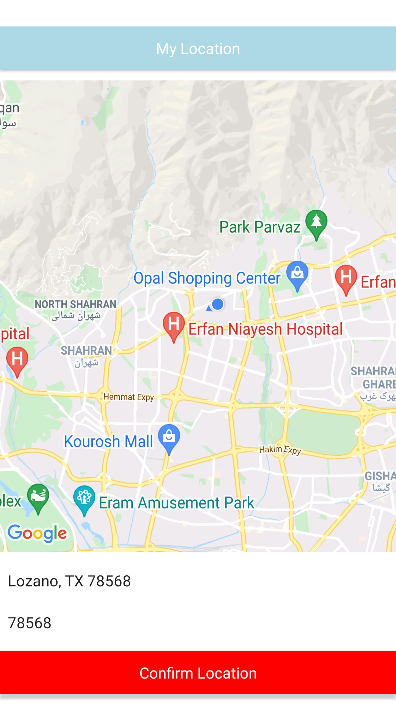
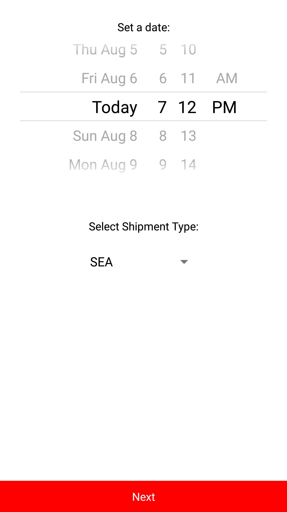
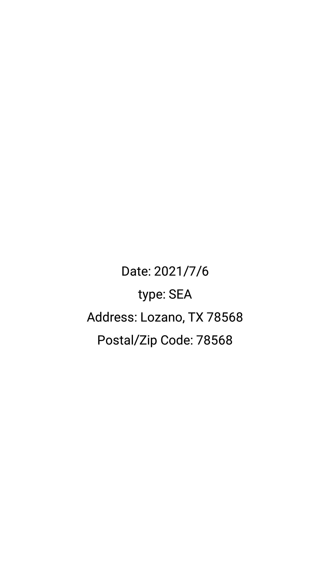

Created using ejected version of `create-react-native-app`

just type `yarn && yarn android` to run the application

- Initialized for android
- Using react-navigation library
- Redux and redux-thunk were used even thought it was not necessary (just for showcase)
- Using both inline style and stylesheets
- Replaced map's default user location camera since it looked to have bugs
- Created a button component since it was used multiple times
- Took almost 2 hours to complete, so do not expect some super fantasy UI, since as you mentioned it was not the point =)
- Since using a non google geocoder , only addresses in USA are supported
- Not using throttler for geocoder
- Using a basic throttler for geocoder
- Whenever you select a location from dropdown menu , camera will be focused to the location attached to it

